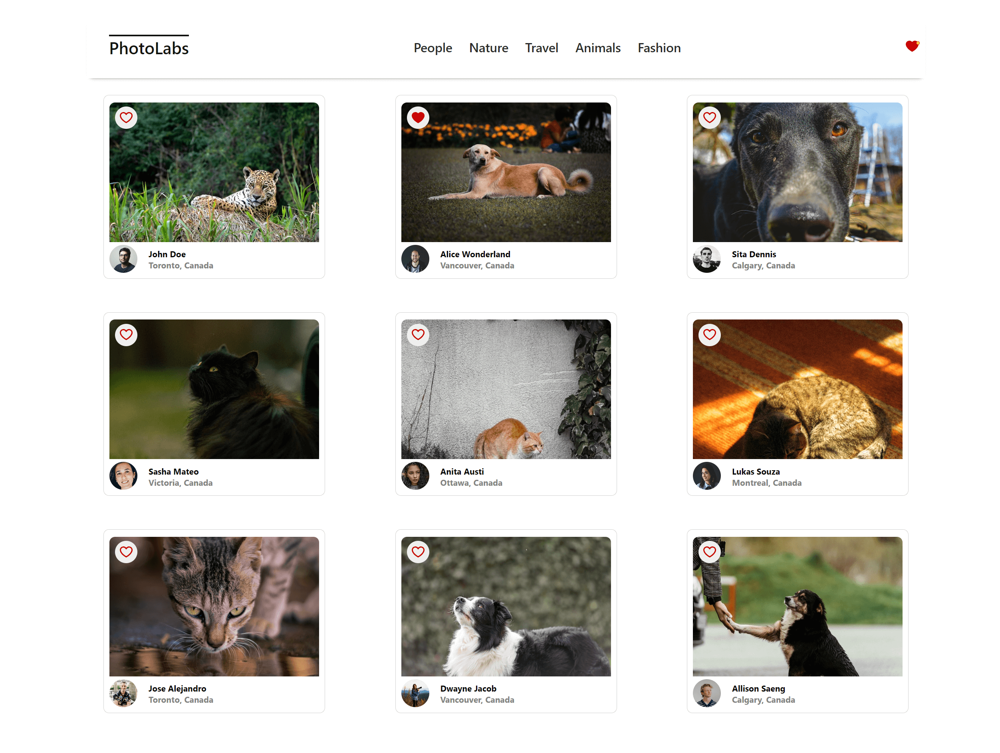
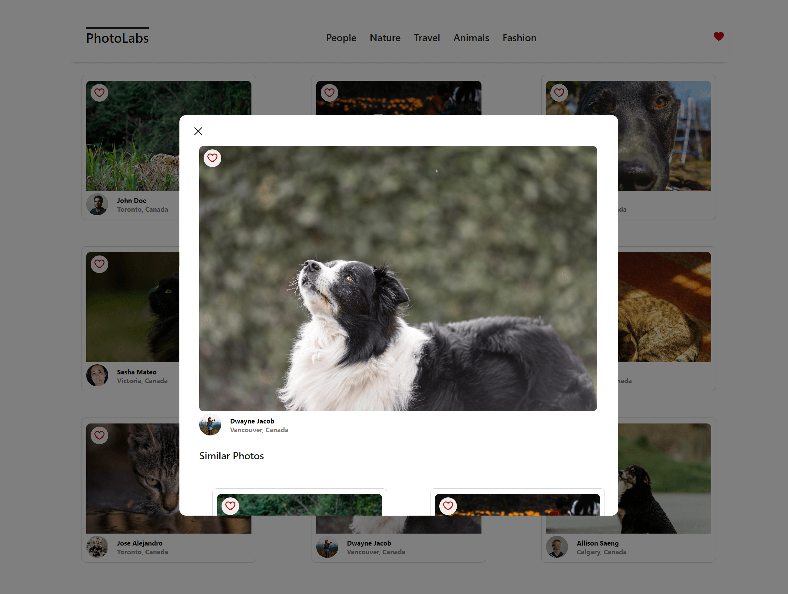

# Photolabs

PhotoLabs is a React-based single-page application (SPA) that enables users to explore photos across various categories, mark photos as their favorites from anywhere within the app, and view enlarged versions along with similar photos by clicking on the thumbnails. Data retrieval is accomplished through Axios, which makes API requests to a PostgreSQL database managed by Express.

## Screenshots
Main View


Modal View


## Dependencies

- react
- react-dom
- react-scripts
- web-vitals
- sass
- axios
- body-parser
- cors
- dotenv
- express
- helmet
- pg
- socket.io
- ws
- jest
- supertest

## Getting Started

Install dependencies with `npm install` in each respective `/frontend` and `/backend`.

### [Frontend] Running Webpack Development Server

```sh
cd frontend
npm start
```

### [Backend] Running Backend Server

Read `backend/readme` for further setup details.

```sh
cd backend
npm start
```
